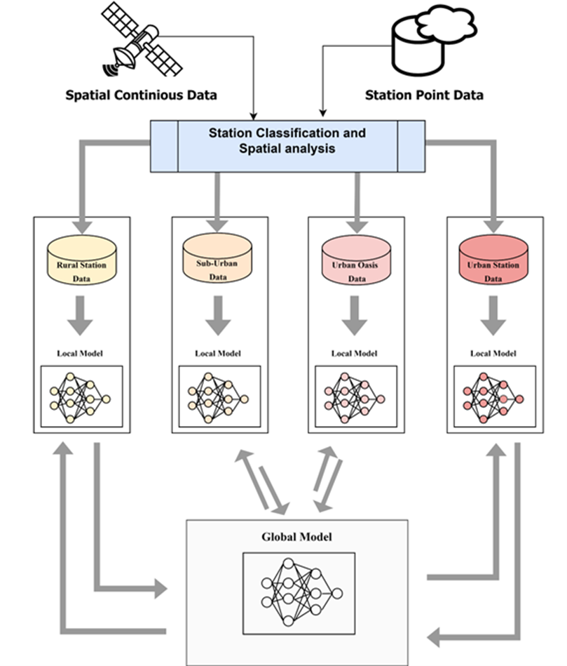

# An improved machine learning-based model for prediction of diurnal and spatially continuous near surface air temperature
Author: Ibrahim Ademola Adeniran 


## Dataset
WHile the remotely sensenced data employed for this study is available for download online, the complete dataset employed for this study is available upon reasonable request from the author of this repository @ [mailto:ibademola@yahoo.com]

List of data employed include:

| Predictor Variable    | Spatial Resolution | Temporal Resolution | Source                                          |
|-----------------------|--------------------|---------------------|-------------------------------------------------|
| Precipitation (PR)    | point              | 1 hour              | HKO                                             |
| Solar radiation (SR)  | point              | 1 hour              | HKO                                             |
| Wind speed (WS)       | point              | 1 hour              | HKO                                             |
| Wind direction (WD)   | point              | 1 hour              | HKO                                             |
| Relative humidity (RH)| point              | 1 hour              | HKO                                             |
| Distance to water (DTW)| point             | 1 year              | Calculated using ArcGIS software                |
| Distance to building (DTB)| point          | 1 year              | Calculated using ArcMap with reference to data building data from building department |
| Longitude             | point              | No                  | Extracted from weather station                  |
| Latitude              | point              | No                  | Extracted from weather station                  |
| Station Class (SC)    | No                 | No                  | Estimated using LCZ and Google Earth data       |
| Population Density (PD)| TCU               | 1 year              | Census and Statistics Department                |
| Elevation             | 5 meters           | No                  | Calculated using ArcMap using DTM               |
| Slope                 | 5 meters           | No                  | Calculated using ArcMap using DTM               |
| Aspect                | 5 meters           | No                  | Calculated using ArcMap using DTM               |
| Hillshade             | 5 meters           | No                  | Calculated using ArcMap using DTM               |
| SVF                   | 5 meters           | No                  | Calculated using ArcMap using DTM and Building height |
| LST                   | 100 meters         | 1 hour              | Satellite data                                  |
| Land utilization (LU) | 10 meters          | 1 year              | HK planning department                          |
| LSE                   | 100 meters         | 1 year              | Satellite data                                  |
| NDVI                  | 100 meters         | 1 year              | Satellite data                                  |
| NDWI                  | 100 meters         | 1 year              | Satellite data                                  |
| NDBI                  | 100 meters         | 1 year              | Satellite data                                  |
| Acquisition date (DOY)| point              | No                  | Derived from satellite metadata                 |
| Acquisition time (TOD)| point              | No                  | Derived from satellite metadata                 |
"""


## Method


## Setup environments
Necessary libraries were put in file `requirements.txt`


## Training & Testing
```commandline
python train.py
```

## Pretrained weights and test results
See [onedrive](https://1drv.ms/f/s!AsLBo0q3zUjCgYRfYHgM8oSZqFsiFg?e=YfJTuf)
- weights of the super-resolution module: `weights/realesrgan`
- weights of the proposed method for height estimation: `weights/realesrgan_feature_aggre_weight_globe`
- Results on testing set:


## Testing on 301 urban centers
- Basic information   
  For large metropolitan areas, the file name is xx_large, while for metropolitan areas, the file name is xx_metro.

- Data and predicted results: see [onedrive](https://1drv.ms/f/s!AsLBo0q3zUjCgYRfYHgM8oSZqFsiFg?e=YfJTuf)  
The mean and std of each urban center is put in `datasetglobe/urbanarea_meanstd.xls` and the results are put in:

- Predicting by yourself
  - Download and put the origin data (S1&S2) in the current directory `data/urban/input_data`  

  - Prepare xx_grid.shp as the prediction unit
    - Download WSF (world settlement footprint) 2019 at 10-m resolution as the valid built-up areas, see the [official website](https://download.geoservice.dlr.de/WSF2019/)
    - Clip WSF to the extent of each urban center
    - Convert the shapefile of urban centers into rasters
    - Split each urban center into grid with size of 640 x 640 m
    - Select the grid with wsf > 20 pixels

  - Predict all the urban centers
```commandline
python predict_realesanet_feature_globe.py
```
- Results:
    -  Distribution

    - The mean and std of building height in each urban center


## Predict other regions
- Download sentinel-1 & sentinel-2 from the GEE
- Download WSF 


## Other files
- Download sentinel-1 & sentinel-2 from the GEE platform
coming soon